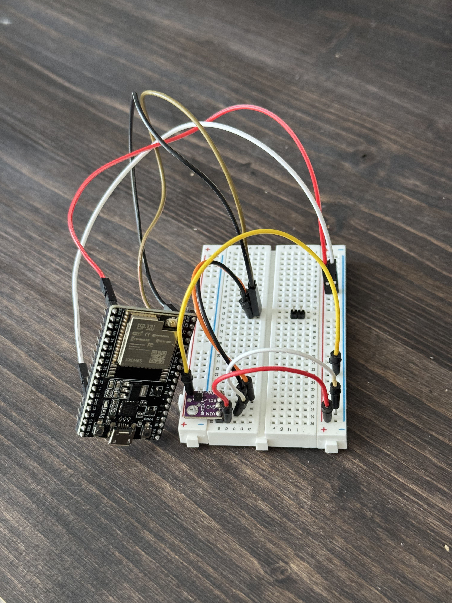
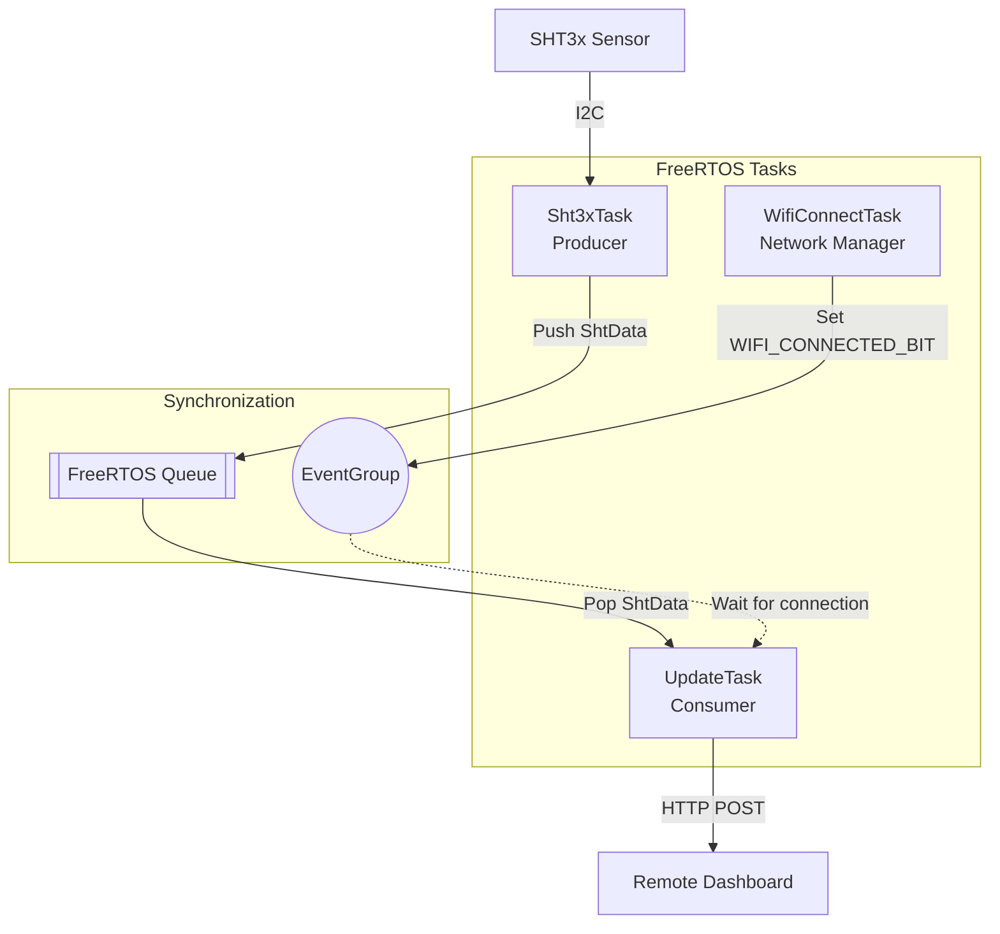

# Home automation Example for the ESP32 using the ESP-IDF framework.

This repo illustrates how the ESP-IDF framework can be used to read temperature and humidity data from a SHT3x sensor
and pushed to a dashboard running in the same local network via http over a Wifi connection.

It demonstrates inter-task comminication using FreeRTOS queues and task synchronization using event groups.
Tasks are encapsulated in C++ classes that manage their own state and functionality, following a modular design pattern. 


# Software Components
The project is built on the **ESP-IDF** framework using **FreeRTOS** for real-time task scheduling and **Modern C++** (C++17/C++20 features) for object-oriented encapsulation and resource management.

# Hardware Components
The following hardware components are required to replicate: 

- Esp32 (any version with wifi should do, I used the ESP32-WROOM-32U)
- SHT3x sensor - specifically, I used the SHT31-D sensor
- The usual peripherals like a breadboard, jumper wires, a USB cable to flash the ESP32, etc.
- (A dashboard to push the data to. This can be ommitted if you just want to print the readings to the serial console)




# Design Overview
The design of the system is based on a modular architecture, where each component is responsible for a specific functionality (task in FreeRTOS jargon). 



The main tasks are:
- Wifi Task: responsible for connecting to the wifi network and maintaining the connection
- Sensor Task: responsible for reading data from the SHT3x sensor at regular time intervals and pushing them to a queue
- Update Task: responsible for pushing the data to the dashboard via HTTP POST requests

Additionally to manage depedencies between the tasks, I use the following synchronization primitives:
- Queue: A static queue used for communication between the Sensor Task and the Update Task.
- Event Group: An event group used to coordinate Update task and Wifi task.


All of the above tasks follow a similar pattern. They are wrapped in classes that encapsulate  the functionality and state of the task.
Each class has a `task()` member function that contains the task logic. 
The `register_task()` member function wraps the FreeRTOS `xTaskCreate()` function setting task parameters, priority etc and starts the task.
As the `xTaskCreate()` function requires a non-member function as the task entry point,
I use a static function `static_task_wrapper()` in the namespace of the respective class that serves as a wrapper to call the non-static `task()` member function
passing the entire class instance as a parameter.

In effect, the pattern to create and start a task is as follows:
```cpp

// Create sensor task with static task queue and read frequency as parameters
Sht3xTask sht_task = Sht3xTask(&queue, TEMP_RECORD_FREQUENCY_MS);
// register task with stack size of 2048 bytes and priority of 8
sht_task.register_task("SHT3x task", 2048, 8);

```

A more detailed technical documentation of the single tasks can be found in the [technical documentation](./assets/TECHNICAL_DOCS.md)

# Build and Deployment

This project requires the ESP-IDF toolchain. Refer to the official ESP-IDF documentation for setup instructions.

1. Ensure your ESP-IDF environment is sourced. 
2. Build the project: `idf.py build`
3. Flash and monitor: `idf.py flash monitor` (make sure to select correct port, usually /dev/ttyUSB0 or similar)

# Prerequisites
The secrets.h file in the include directory has the following form. This is required, if the Wifi SSID & password is not available in the NVS.

```C++
#ifndef SECRETS_H
#define SECRETS_H

#include <string>
constexpr std::string WIFI_SSID = "YourSSID";
constexpr std::string WIFI_PASSWORD = "YourPassword";

#endif // SECRETS_H
```


# Roadmap
- [ ] Wifi Configuration
  - [ ] Setup Event handler to handle case where after x retries, still not connection established.
- [ ] Unit tests for components
- [ ] Global Error Handling and logging
- [ ] Take energy consumption into account
